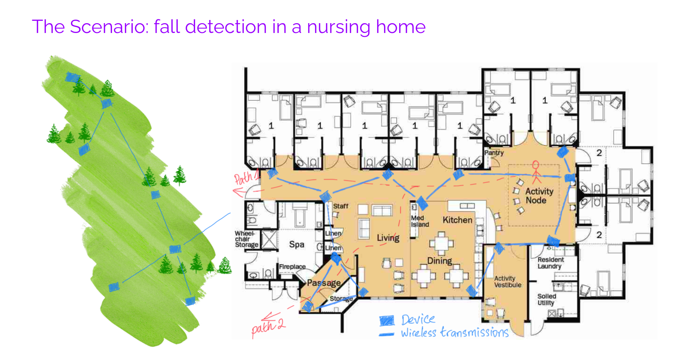
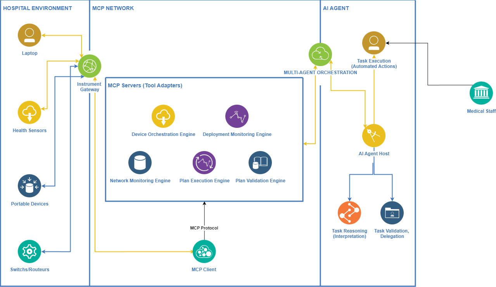

# Project 2: LLMs for Intent-Based Task Orchestration in Medical IoT

## 1. General context: Fall Detection in Nursing Home

Modern medical research laboratories have integrated gradually into smart workspace environments, with the integration of heterogeneous IoT devices and services [2,3,6]. However, researchers and laboratory staff, usually non-IT users, require intuitive ways to express their intents, without manually configuring each device. Large Language Models (LLMs) have emphasized the capabilities in reasoning, planning, and task orchestration, providing a promising methodology for translating natural user intents into executable laboratory operations [13,14].

This project aims to develop an LLM-driven orchestration engine [1,6] for medical research laboratories. The system enables clinicians to interact with medical datasets, IoT-connected sequencing devices, and AI models through natural language queries, automating data retrieval, analysis, and workflow execution [7]. By combining real-time deployment tracking, AI-assisted reasoning, and optimized MCP workflow orchestration, the system ensures accurate, efficient, and secure analysis.



### Scenario Documentation

**Detailed scenario explanation available in**: `scenario-specification/m2cns-sr-InternetOfThings-Projects__updatedJan06.pdf` directory

The complete scenario includes:
- **AI Agent Decision Flow**: How LLM agents analyze user intent → generate orchestration plans → validate constraints → execute on devices
- **High-to-Low Level Interaction**: User intent flows through network config agent → device orchestration → deployment monitor → plan validation → actual device commands
- **Sensor/Actuator Interaction**: Low-level device communication (MQTT/HTTP/REST) with real-time feedback loops for fall detection
- **Multi-Agent Orchestration**: CrewAI framework coordinating 5 agents for intent interpretation, planning, validation, and execution
- **Real-Time Feedback**: Sensor data collection → AI analysis → corrective actions → constraint re-validation 
---

## 2. Reproducibility instructions: Setup of the environment and Execution steps

### Prerequisites

```bash
# Navigate to project directory
cd /home/ad/2526-m2cns-llm-intent-orchestration/mcp-orchestration-prototype

# Activate Python virtual environment
source /home/ad/.local/share/virtualenvs/ad-8QUC6BsB/bin/activate

# Set required environment variables
export GEMINI_API_KEY="your-gemini-api-key"
export FASTMCP_BASE="http://127.0.0.1:8000"
```

### Starting the Server

```bash
# Terminal 1: Start FastAPI server
cd /home/ad/2526-m2cns-llm-intent-orchestration/mcp-orchestration-prototype
uvicorn servers.app:app --host 127.0.0.1 --port 8000
```

### Running the Client

#### Option 1: Interactive Chat Mode (with AI Agent)

```bash
# Terminal 2: Run interactive client
cd /home/ad/2526-m2cns-llm-intent-orchestration/mcp-orchestration-prototype
source /home/ad/.local/share/virtualenvs/ad-8QUC6BsB/bin/activate
python3 clients/clients.py --interactive

# Menu options:
# 1) Chat with agent (AI-powered)
# 2) Run MCP task directly (JSON payload)
# 3) View agent information
# 4) View task actions
# 5) Quit
```

#### Option 2: Direct API Calls (curl)

```bash
# Fall Detection Plan Generation
curl -X POST http://127.0.0.1:8000/tasks/device-orchestration \
  -H "Content-Type: application/json" \
  -d '{
    "action": "generate_plan",
    "intent": "Generate a plan for fall detection in a nursing home corridor"
  }'
```

#### Option 3: Test Scenario Script

```bash
# List available agents
python3 test_scenarios.py list

# List scenarios for specific agent
python3 test_scenarios.py device-orchestration list
```
---

## 3. System Architecture

### Directory Structure
```
mcp-orchestration-prototype/
├── servers/
│   ├── app.py                           # FastAPI application
│   ├── agents.py                        # Agent initialization
│   ├── utils.py                         # Utility functions
│   └── tasks/                           # Agent implementations
│       ├── device_orchestration.py      # Intent → Plans
│       ├── deployment_monitoring.py     # Device status tracking
│       ├── network_configuration.py     # Network config & OTA
│       ├── plan_validation.py           # Constraint validation
│       └── access_control.py            # Role-based access
├── data/                                # Configuration files
│   ├── deployment_monitoring.json       # Device registry
│   ├── energy_transmission_models.json  # Power & bandwidth specs
│   ├── security_policies.json           # Access & encryption
│   ├── validation_rules.json            # Constraint rules
│   ├── ota_server_config.json           # Firmware management
│   └── network_policies.json            # Network config
├── tests/                               # Test suites (38+ tests)
│   ├── test_tasks.py
│   ├── test_plan_validation.py
│   └── test_network_configuration.py
└── clients/                             # Test client
    └── clients.py
```

### Agent Components

| Agent | Purpose | Key Features |
|-------|---------|--------------|
| **device_orchestration** | Intent → Execution Plans | Plan generation, execution, analysis |
| **deployment_monitoring** | Device Tracking | Status, location, service discovery |
| **plan_validation** | Constraint Checking | Energy, transmission, security, privacy, location |
| **plan_execution** | Execute Plans on Devices | HTTP/MQTT execution, sequential/parallel modes, monitoring |
| **network_configuration** | Network Auto-Config | Intent-based config, OTA (push/pull) |
| **access_control** | Permissions | Role-based access, device-level control |

### Data Flow

```
User Intent → Network Config Agent → Device Orchestration Agent
           ↓
    Deployment Monitor (verify devices)
           ↓
    Plan Validation (energy, security, privacy, network, location)
           ↓
    Plan Execution (HTTP/MQTT commands to devices)
           ↓
    Monitoring & Feedback (device responses, error handling)
```

### IoT Deployment
- **6 Devices**: esp32-001 (camera), esp32-002/003 (sensors), esp32-004 (light), esp32-005 (motion), esp32-006 (display)
- **Protocols**: WiFi (WPA2-PSK), MQTT (primary 192.168.1.200:1883, backup 192.168.1.201:1883)
- **OTA Server**: 192.168.1.100:8080

### API Endpoints

```
POST /tasks/device-orchestration
  • generate_plan, execute_intent, execute, list_plans, analyze, query_devices

POST /tasks/deployment-monitoring
  • status, device_info, query_location, query_service, query_status, query_capability, active_devices, connectivity, query

POST /tasks/plan-validation
  • validate, validate_and_optimize, recommendations

POST /tasks/plan-execution
  • execute, execute_and_monitor, get_history, monitor

POST /tasks/network-configuration
  • configure_from_intent, ota_update, ota_status

POST /tasks/access-control
  • op: check, grant, revoke
```

---

## 3. Overall architecture of the proposed approach

The orchestration engine uses a modular pipeline with five coordinated agents: 


**Core Components**:
- **Sensors/Actuators**: LED, ventilation, motion actuators, cameras, temperature sensors
- **Instrument Gateway**: Normalizes IoT data, ensures secure communication
- **MCP Servers**: Device orchestration, monitoring, plan validation, plan execution, network config, access control
- **MCP Client**: Communication hub between AI agent and MCP servers
- **Plan Execution Engine**: Translates high-level instructions to HTTP/MQTT device commands
- **API Management**: Coordinates agent-tool interactions, enforces policies
- **LLM Agent**: Interprets requests, generates workflows, validates plans
- **MultiAgent Framework**: CrewAI for autonomous task delegation

---

### 4. Results analysis and interpretation
The results demonstrate that the proposed framework, presented in scientific poster (https://docs.google.com/presentation/d/1sjb98RdPvPluqPrXfDPUFQcB2jeN8Rqh/edit?slide=id.p1#slide=id.p1), successfully integrates multiple medical IoT projects into a unified, MCP-compliant platform capable of interoperable data analysis, device coordination, and service health monitoring. Validation on Arduino-based medical devices confirms reliable deployment and execution of event-driven, time-driven, and condition-based workflows in safety-critical healthcare environments. The integration of AI-based energy-aware monitoring and reasoning agents enables effective translation of high-level user intentions into coordinated medical service actions, while the modular architecture ensures scalability across diverse healthcare scenarios. Overall, the system shows strong potential for intelligent, energy-efficient orchestration of medical IoT infrastructures, laying a solid foundation for advanced plan validation and optimization mechanisms in future work.

---

## References

[1] LLMind: Orchestrating AI and IoT with LLM for Complex Task Execution. arXiv. Available: https://arxiv.org/pdf/2312.09007  

[2] SmartIntent: A Serverless LLM-Oriented Architecture for Intent-Driven Building Automation. ResearchGate. Available: https://www.researchgate.net/publication/397059674  

[3] LLM Agents for Internet of Things (IoT) Applications. CS598 JY2-Topics in LLM Agents. Available: https://openreview.net/pdf?id=BikB3f8ByV  

[4] A Survey on IoT Application Architectures. MDPI Sensors. Available: https://www.mdpi.com/1424-8220/24/16/5320  

[5] Tree-of-Thought vs Chain-of-Thought for LLMs. arXiv. Available: https://arxiv.org/html/2401.14295v3  

[6] Introduction to Model Context Protocol. Available: https://anthropic.skilljar.com/introduction-to-model-context-protocol

[7] Model Context Protocol (MCP): Landscape, Security Threats, and Future Research Directions. arXiv. Available: https://arxiv.org/pdf/2503.23278

[8] Small stimulation for better understanding ESP32 MQTT. Available: https://wokwi.com/projects/449799275283840001

[9] Orchestration in the Cloud-to-Things
compute continuum: taxonomy, survey
and future directions. Journal of Cloud Computing:
Advances, Systems and Applications. Available: [https://www.mdpi.com/1424-8220/24/16/5320](https://arxiv.org/abs/2309.02172)

[10] A Taxonomy and Survey of Cloud Resource Orchestration Techniques. ACM. Available: https://dl.acm.org/doi/10.1145/3054177

[11] An IoT-Based Computational Intelligence Model to Perform Gene Analytics in Paternity Testing and Comparison for Health 4.0. Journal of Theoretical and Applied Information Technology. Available: [https://www.researchgate.net/profile/Vijay-Arputharaj/publication](https://www.researchgate.net/profile/Vijay-Arputharaj/publication/372809441_AN_IOT-BASED_COMPUTATIONAL_INTELLIGENCE_MODEL_TO_PERFORM_GENE_ANALYTICS_IN_PATERNITY_TESTING_AND_COMPARISON_FOR_HEALTH_40/links/64c93a734ce9131cd57d5cb2/AN-IOT-BASED-COMPUTATIONAL-INTELLIGENCE-MODEL-TO-PERFORM-GENE-ANALYTICS-IN-PATERNITY-TESTING-AND-COMPARISON-FOR-HEALTH-40.pdf?__cf_chl_tk=FBZhMjr0Gl3WpIEQ5mBgiqqOPpO6C_HdUVGlTXswqgA-1765459717-1.0.1.1-1S7HVdLCBWGhhvRh2MrnipcVHh6bU81rwAWyMAvz_zk)

[12] Blockchain and smart contract for IoT
enabled smart agriculture. PeerJ. Available: https://peerj.com/articles/cs-407.pdf

[13] Evaluation of IoT-Enabled hybrid model for genome sequence analysis of patients in healthcare 4.0. ScienceDirect. Available: https://www.sciencedirect.com/science/article/pii/S2665917423000156

[14] Toward Intent-Based Network Automation for
Smart Environments: A Healthcare 4.0 Use Case. IEEE. Available: https://ieeexplore.ieee.org/stamp/stamp.jsp?arnumber=10336815

[15] Orchestration Automation by N8N. Available: https://docs.n8n.io/

[16] Connection between IOT devices and Orchestration Protocl. Available: https://github.com/ezhuk/mqtt-mcp?tab=readme-ov-file

